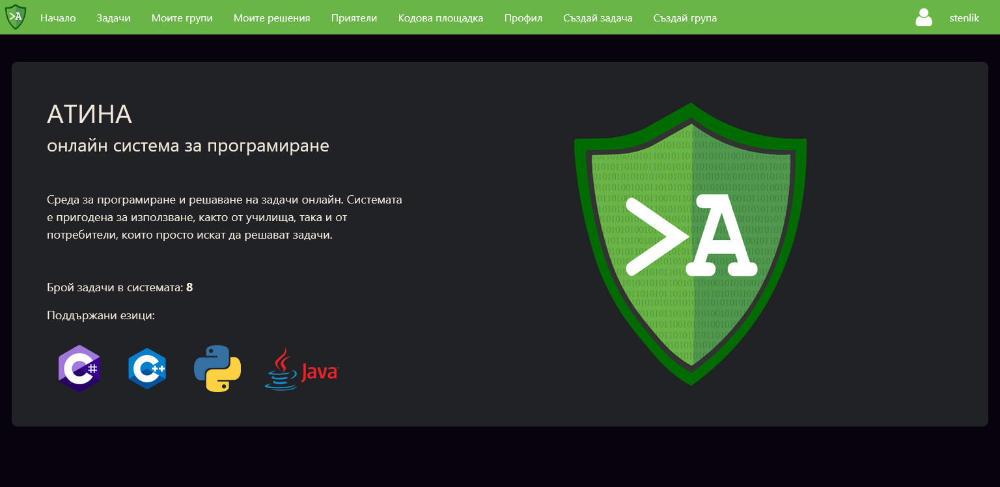
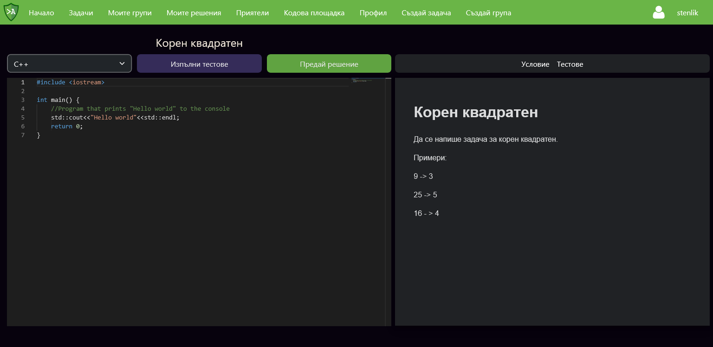
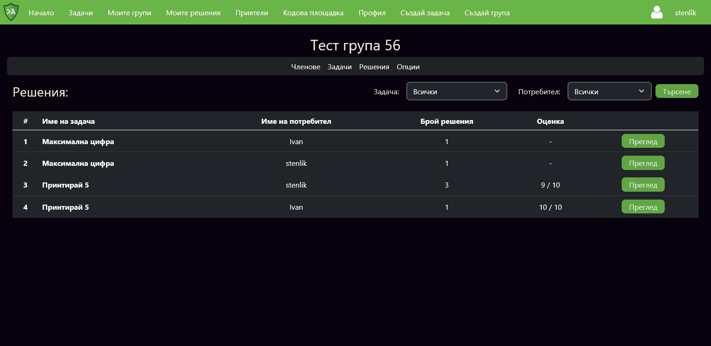
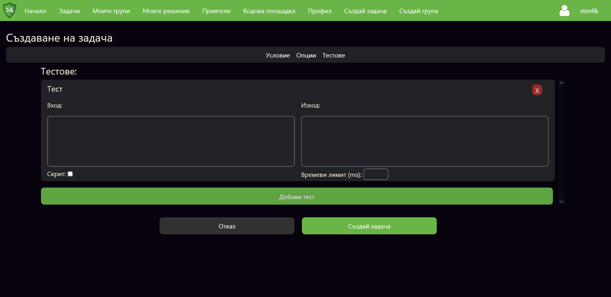

# Athena - online programming platform

**Athena is an online programming platform for coding and solving problems in multiple languages, supporting both individual users and educational institutions with features like code exams, evaluation, and group 
assignments.**

## Features
- Online coding environment for creating and solving programming tasks
- Support for multiple programming languages
- Organize users into groups
- Assign a programming tasks for each group
- Automated testing and evaluation of submitted solutions
- Code playground for writing and running code instantly

## Technologies used
- **Angular** - powers the frontend for the platform
- **Typescript** - ensures structured frontend code
- **NodeJS** - handles frontend logic and real-time processing
- **Python** - supports backend functionalities and database communication
- **Flask**  - serves API requests and manages backend operations
- **MongoDB** - stores user data, task assignments, and results
- **Amazon Web Services** - hosts the platform and ensures scalability

## Pictures

 

## How to run

In order to run the platform locally you have to:
- Install NodeJS and Angular
- Install Python and pip3
- Install MongoDB
- To run the frontend:
    - Install the mandatory node packages with `npm install`
    - Check the frontend config file located in `frontend/project/src/assets/conf.json`
    - Run the frontend with `ng serve`
- To run the backend:
    - Install the mandatory python packages with `pip3 install -r requirements.txt`
    - Check the backend config file located in `backend/src/mongo_connection/app_config.json`
    - Start the backend with `python3 main.py`
- To run the executor service:
    - Install the mandatory python packages with `pip3 install -r requirements.txt`
    - Start the executor service with `python3 main.py`

## Licence

[GPL-3.0](https://choosealicense.com/licenses/gpl-3.0/)
